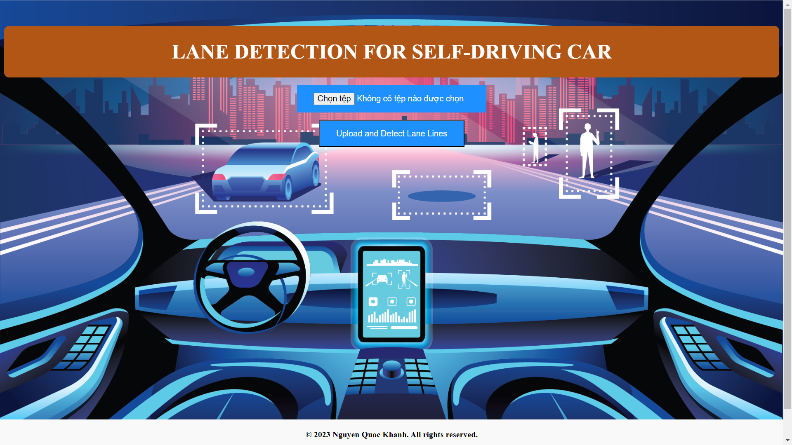

<a name="readme-top"></a>
<div align="center">
  <p align="center">
    <a href="https://www.youtube.com/watch?v=4aPsZ5zp0sk">View Demo</a>
    ·
    <a href="https://github.com/nqkhanh2002/CinnamonBootcamp2023_PreEntrace/issues">Report Bug</a>
    ·
    <a href="https://github.com/nqkhanh2002/CinnamonBootcamp2023_PreEntrace/pulls">Request Feature</a>
  </p>
</div>

<h1 align="center">LANE DETECTION APPLICATION IN SELF-DRIVING CAR</h1>

<div align="center">
  
</div>

**Lane detection** is a computer vision task that involves identifying the boundaries of driving lanes in video or image scenes. The goal is to accurately locate and track the lane markings in real-time, even in challenging conditions such as low light, glare, or complex road layouts.

This repository develops a lane detection and tracking solution for self-driving cars. It is a crucial component of an autonomous driving system, ensuring safety and efficiency for the driver and passengers on the road.

# Project Structure
> **This is an English version and an improved repository based on [the original repository](https://github.com/nqkhanh2002/Lane-Detection-for-Self-Driving-Cars), which represents the previous research results and my independent work.**

# Pipline
The implementation problem consists of 3 parts:
1. Traditional image processing method
2. Deep Learning Method
3. Build a user interface (GUI) to deliver a quick demo application
------- 
## Traditional image processing Method
**1. Compute the camera calibration matrix and distortion coefficients.**

> This step involves calibrating the camera used for capturing images or videos. By taking multiple calibration images of a chessboard pattern from different angles, the camera calibration matrix and distortion coefficients can be computed. These parameters are essential for correcting the distortion in the subsequent image processing steps.
> 
**2. Apply a distortion correction to raw images.**

> Using the camera calibration matrix and distortion coefficients obtained in the previous step, the raw images captured by the camera can be undistorted. This correction ensures that straight lines appear straight in the image, reducing any distortion caused by the camera lens.

**3. Apply a perspective transform to generate a “bird’s-eye view” of the image.**

> Perspective transformation is applied to convert the undistorted image from a regular view to a top-down view, resembling a bird's-eye view. This transformation helps to focus on the lane region of interest and simplifies the subsequent lane detection process.

**4. Use color transforms (HSL) to create a thresholded binary image.**

> Different color spaces, gradient-based edge detection, and other image processing techniques are used to create a binary image where the lane markings are highlighted. Thresholding techniques are applied to identify the pixels that likely belong to the lanes based on their color or gradient properties.

**5. Detect lane pixels and fit to find the lane boundary.**

> Lane pixels are detected by applying a pixel-wise search or sliding window search on the thresholded binary image. The detected pixels are then used to fit a mathematical model (e.g., polynomial) that represents the lane boundary. This step determines the shape and position of the detected lanes.

**6. Determine the curvature of the lane and vehicle position with respect to center.**

> Using the fitted lane boundary, the curvature of the lane can be calculated. This provides valuable information about the curvature radius, which is essential for controlling the vehicle during self-driving. Additionally, the vehicle's position with respect to the lane center can be determined, allowing for appropriate adjustments in driving behavior.

**7. Warp the detected lane boundaries back onto the original image and display information for ADAS System. Information displayed includes:**
* **LKAS: Lane Keeping Assist System with Vietnamese traffic signs**
* **LDWS: Lane Departure Warning System ((Not aiming to develop in this method but develop in Deep Learning method)**
* **Vehicle position from center**
* **And finally Frame ID and FPS are displayed in the upper right corner for testing**


> The detected lane boundaries, along with the calculated curvature and vehicle position, are mapped back onto the original undistorted image. This step visualizes the detected lanes and provides important information for an Advanced Driver Assistance System (ADAS). The displayed information may include LKAS (Lane Keeping Assist System) with Vietnamese traffic signs, LDWS (Lane Departure Warning System), the vehicle's position from the center, and other relevant details. Additionally, for testing purposes, the Frame ID and Frames Per Second (FPS) can be displayed in the upper right corner of the image.

## Deep Learning Method
> **This method is still in development because I train the model on ONNX and TensorRT so I'm stuck with NVIDIA GPUs and I don't have time to solve this Pre-Entrance test.**
1. **Lane Detector**: Ultra Fast Lane Detection ([V1](https://github.com/cfzd/Ultra-Fast-Lane-Detection) & [V2](https://github.com/cfzd/Ultra-Fast-Lane-Detection-v2)) on backbone ResNet (18 & 34)
2. **Vehicle Detector**: [YOLOv8 (v8m & v8l)](https://github.com/ultralytics/ultralytics) [ONNX](https://github.com/ibaiGorordo/ONNX-YOLOv8-Object-Detection) 
## Build a user interface (GUI) to deliver a quick demo application

## Usage
1. Git clone this repository:
```
git clone https://github.com/nqkhanh2002/CinnamonBootcamp2023_PreEntrace.git
```
2. Install the required libraries with the following command:
```
pip install -r requirements.txt
```
3. Launch Flask interface
 ```
 python app.py
 ```
4. Go to the development server at [127.0.0.1:5000](http://127.0.0.1:5000/) in a web browser. Use **Ctrl + C** to exit the program.
5. Demo setting process is available [here](https://www.youtube.com/watch?v=j-Rbf1Wvl6M&t=4s). Some test data (image and video) can be accessed [here](https://drive.google.com/drive/folders/1BtCvko4PB6_j2ljuAsCYnpVnhCQomFjg?usp=sharing).

## Final Result
<div align="center">
  <a href="https://www.youtube.com/watch?v=4aPsZ5zp0sk">
    
  </a>
</div>

